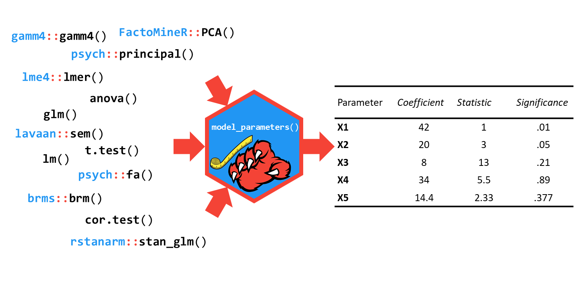
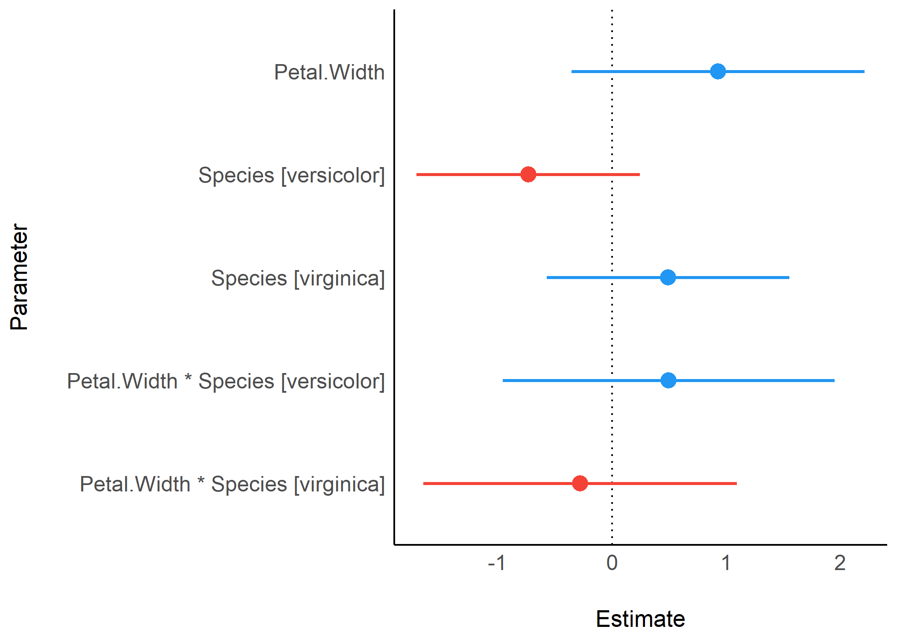

# Summary

The recent growth of data science is partly fuelled by the ever-growing amount of data and the joint important developments in statistical modelling. New and powerful models and frameworks are becomming accessible to users, however, although there exist some generic functions to obtain model summaries and parameters, many package-specific modeling functions do not provide such methods to allow users to access such valuable information. 

# Aims of the Package

**parameters** is an R-package [@rcore] that fills this important gap. Its primary goal is to provide utilities for processing the parameters of various statistical models. Beyond computing p-values, standard errors, confidence intervals (CI), Bayesian indices and other measures for a wide variety of models, this package implements features like parameters bootstrapping and engineering (such as variables reduction and/or selection), or tools for data reduction like functions to perform cluster, factor or principal component analysis.

Another important goal of the **parameters** package is to facilitate and streamline the process of reporting results of statistical models, which includes the easy and intuitive calculation of standardized estimates or robust standard errors and p-values. **parameters** therefor offers a simple and unified syntax to process a large variety of (model) objects from many different packages.

**parameters** is part of the [*easystats*](https://github.com/easystats/easystats) ecosystem, a collaborative project created to facilitate the usage of R for statistical analyses.

# Comparison to other Packages

**parameters** functionality is in parts comparable to packages like **broom** [@robinson_broom_2020], **finalfit** [@harrison2020finalfit] or **stargazer** [@hlavac_stargazer_2018] (and maybe some more). Yet, there are some notable differences, e.g.:

- **broom** (via `glance()`), **finalfit** (via `ff_metrics()`) and **stargazer** (via `stargazer()`) report fit indices such as R2 or AIC by default, **parameters** does not. However, there is a dedicated package in the *easystats* project for assessing regression model quality and fit indices, **performance** [@luedecke2020performance].
- **parameters** easily allows to compute standardized estimates, robust estimation, small-sample-size corrections for degrees of freedom (like *Satterthwaite* or *Kenward-Roger*), bootstrapping or simulating parameters, and feature reduction. Furthermore, **parameters** provides functions to test for the presence or absence of an effect [_equivalence testing_, see @lakens2020equivalence].
- For most functions, [easy-to-use `plot()`-methods](https://easystats.github.io/see/articles/parameters.html) exist to quickly create nice looking plots (powered by the **see** package [@ludecke2020see]).
- **parameters** is a very lightweight package. Its main functionality only relies on the **insight** and the **bayestestR** packages [@ludecke2019insight; @makowski2019bayetestR] to access and process information contained in models, and these packages in turn only depend on R core packages. However, additional features that do not belong to the core functions of **parameters** require the installation of other packages, such as **sandwich** [@zeileis2006] for robust estimation, **psych** [@revelle_psych_2019] for factor analysis or PCA or **cAIC4** [@saefken_caic4_2018] for parameter selection for mixed models.

# Examples of Features

As stated above, **parameters** creates summary tables of many different statistical models. The workflow is simple: fit a model, put it into the `model_parameters()` functions (or its shortcut, `parameters()`) and the result is complete. 



In the following, we show some brief examples. However, a comprehensive overview including in-depth examples are accessible via the dedicated website (https://easystats.github.io/parameters/).

## Summary of Model Parameters

`model_parameters()` allows you to extract the parameters and their characteristics from various models in a consistent way.

``` r
library(parameters)

model <- lm(Sepal.Length ~ Species, data = iris)
parameters(model)

#> Parameter            | Coefficient |   SE |       95% CI |      p
#> -----------------------------------------------------------------
#> (Intercept)          |        5.01 | 0.07 | [4.86, 5.15] | < .001
#> Species [versicolor] |        0.93 | 0.10 | [0.73, 1.13] | < .001
#> Species [virginica]  |        1.58 | 0.10 | [1.38, 1.79] | < .001
```

Extraction of robust indices is possible for many models, in particular models supported by the **sandwich** [@zeileis2006] and **clubSandwich** [@pustejovsky2020] packages.

``` r
parameters(model, robust = TRUE)

#> Parameter            | Coefficient |   SE |       95% CI |      p
#> -----------------------------------------------------------------
#> (Intercept)          |        5.01 | 0.05 | [4.91, 5.11] | < .001
#> Species [versicolor] |        0.93 | 0.09 | [0.75, 1.11] | < .001
#> Species [virginica]  |        1.58 | 0.10 | [1.38, 1.79] | < .001
```

For linear mixed models, `parameters()` also allows to specify the method for approximating degrees of freedom, which may improve the accurracy for calculated standard errors or p-values.

``` r
library(lme4)
model <- lmer(
  Sepal.Length ~ Sepal.Width * Petal.Length + (1 | Species), 
  data = iris
)

parameters(model, digits = 3)

#> Parameter                  | Coefficient |    SE |         95% CI |      p
#> --------------------------------------------------------------------------
#> (Intercept)                |       0.707 | 0.652 | [-0.57,  1.98] | 0.278 
#> Sepal.Width                |       0.731 | 0.156 | [ 0.43,  1.04] | < .001
#> Petal.Length               |       1.023 | 0.143 | [ 0.74,  1.30] | < .001
#> Sepal.Width * Petal.Length |      -0.084 | 0.040 | [-0.16, -0.01] | 0.035 

parameters(model, digits = 3, df_method = "kenward")

#> Parameter                  | Coefficient |    SE |         95% CI |      p
#> --------------------------------------------------------------------------
#> (Intercept)                |       0.707 | 0.654 | [-0.70,  2.11] | 0.298 
#> Sepal.Width                |       0.731 | 0.157 | [ 0.42,  1.04] | < .001
#> Petal.Length               |       1.023 | 0.145 | [ 0.74,  1.31] | < .001
#> Sepal.Width * Petal.Length |      -0.084 | 0.040 | [-0.16, -0.01] | 0.037 
```

## Visualisation

**parameters** functions also include plotting capabilities via the [**see** package](https://easystats.github.io/see/) [@ludecke2020see]. A complete overview of plotting functions is available at the *see* website (https://easystats.github.io/see/articles/parameters.html).

```r
library(see)

model <- lm(Sepal.Length ~ Petal.Width * Species, data=iris)
plot(parameters(model))
```



# Licensing and Availability

**parameters** is licensed under the GNU General Public License (v3.0), with all source code stored at GitHub (https://github.com/easystats/parameters), and with a corresponding issue tracker for bug reporting and feature enhancements. In the spirit of honest and open science, we encourage requests/tips for fixes, feature updates, as well as general questions and concerns via direct interaction with contributors and developers.

# Acknowledgments

**parameters** is part of the collaborative [*easystats*](https://github.com/easystats/easystats) ecosystem. Thus, we would like to thank the [members of easystats](https://github.com/orgs/easystats/people) as well as the users.

# References
